WEEK 03
Praktikum 01

Praktikum 02

Praktikum 03
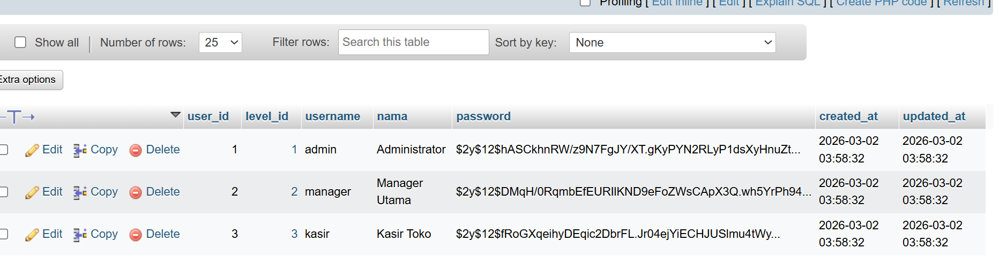
Praktikum 04

Praktikum 05

Praktikum 06

WEEK 04
Praktikum 1
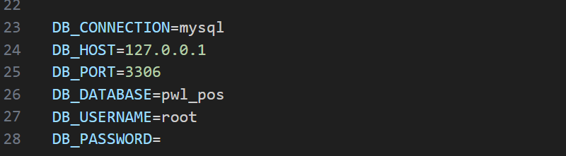
Praktikum 2.1

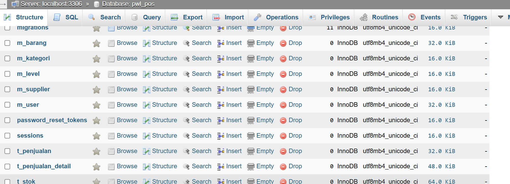
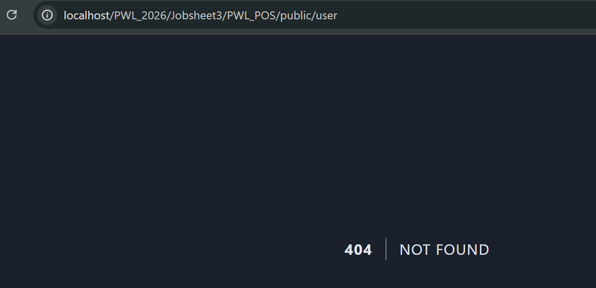
Praktikum 2.2

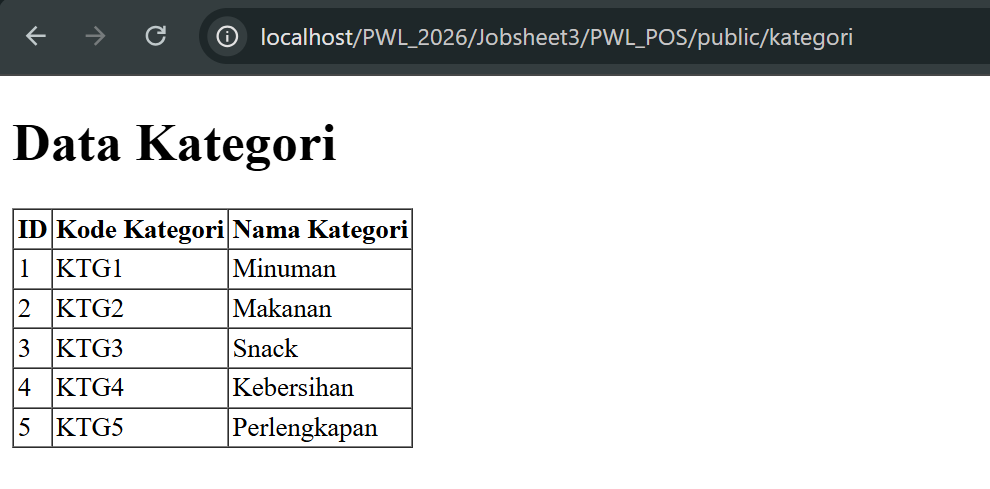
Praktikum 2.3
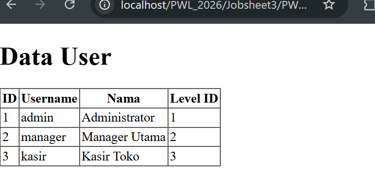
Praktikum 2.4
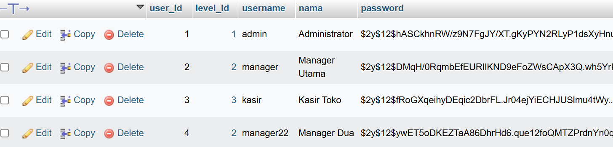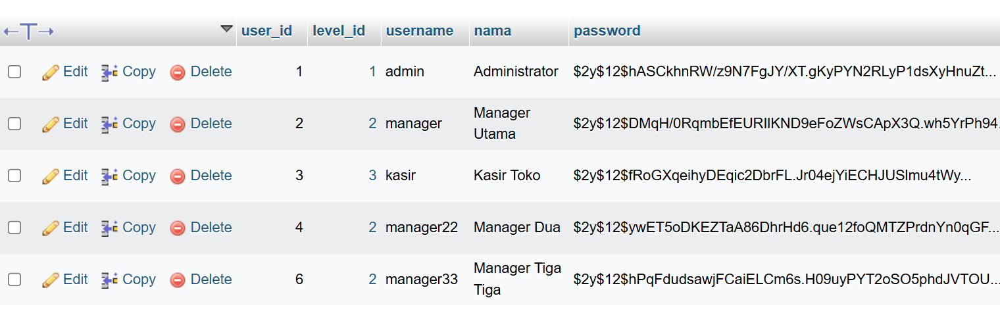
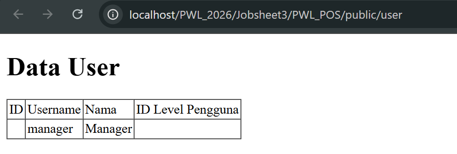
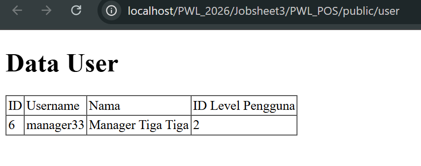
Praktikum 2.5
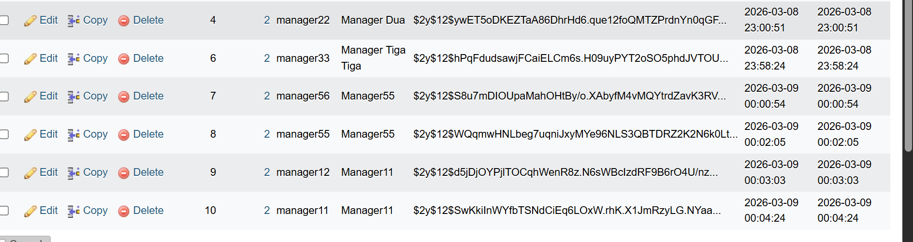
Praktikum 2.6
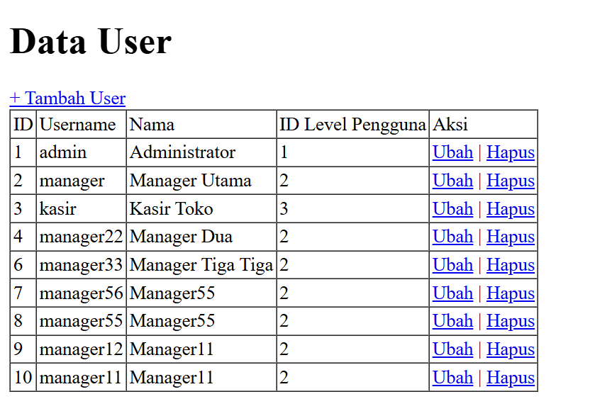
Praktikum 2.7
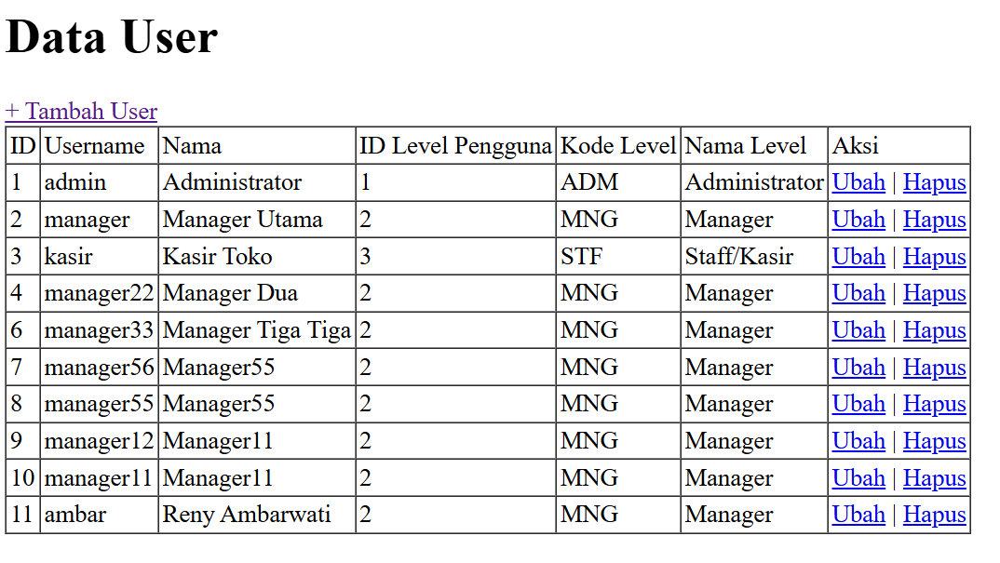
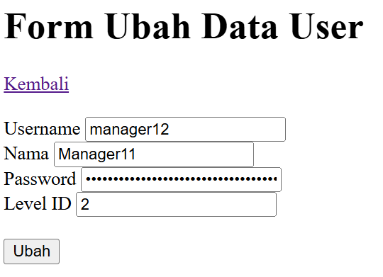

