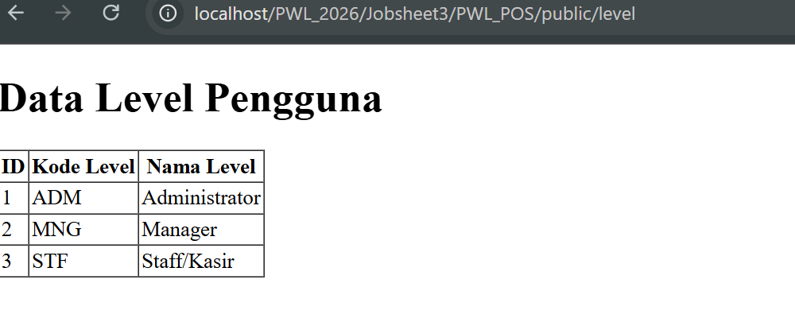

**Nama:** Reny Ambarwati 
**NIM:** 244107020066
**Kelas:** TI-2F

## Laporan Jobsheet 1: Implementasi Form Elements & Resource Post di Filament1

# 1. Tujuan Praktikum
Setelah mengikuti praktikum ini, mahasiswa diharapkan mampu:
Membuat Resource Post di framework Filament
Mengimplementasikan berbagai komponen formulir (Form Components).
Menghubungkan komponen Select dengan relasi database (Category).
Mengelola unggahan file (File Upload) dan menampilkannya kembali dalam tabel menggunakan Image Column.
Menampilkan data relasi pada tabel admin.

# 2. Langkah Kerja
A. Pembuatan Resource Post
Menjalankan perintah php artisan make:filament-resource Post.
Konfigurasi awal: Model attribute menggunakan title, serta tidak men-generate halaman read-only maupun konfigurasi otomatis dari database.

B. Implementasi Form Elements (File: PostForm.php)
Berbagai elemen formulir ditambahkan untuk memperkaya input data, antara lain:
Text Input: Digunakan untuk kolom title dan slug.

Select (Relasi Category): Menggunakan relationship('category', 'name') untuk mengambil data dari tabel kategori.

Color Picker: Untuk memilih warna secara visual.
Editor: Menggunakan MarkdownEditor atau RichEditor untuk mengisi konten tubuh (body).
File Upload: Mengatur unggahan gambar ke disk public di direktori posts.
Tags Input: Digunakan untuk input tag (memerlukan casting array pada model).
Checkbox & DateTimePicker: Digunakan untuk status publikasi (published) dan waktu tayang (published_at).

C. Menampilkan Data pada Tabel (File: PostsTable.php)
Untuk menampilkan data yang telah diinput, kolom berikut dikonfigurasi:
TextColumn: Untuk title, slug, dan relasi category.name.
ColorColumn: Menampilkan pratinjau warna.
ImageColumn: Menampilkan pratinjau gambar yang diunggah.

D. Konfigurasi Tambahan
Storage Link: Menjalankan php artisan storage:link agar gambar yang diunggah di folder storage dapat diakses oleh publik/browser.
Redirect: Menambahkan fungsi getRedirectUrl() pada CreatePost.php dan EditPost.php agar pengguna diarahkan kembali ke halaman indeks setelah menyimpan data.

# 3. Analisis & Diskusi

    1. Fungsi storage:link: Diperlukan untuk menghubungkan folder penyimpanan internal (storage/app/public) ke folder yang dapat diakses publik (public/storage) sehingga file seperti gambar dapat ditampilkan di browser.21
    3. Relasi pada Tabel: Penggunaan category.name (bukan category_id) bertujuan untuk menampilkan informasi yang mudah dibaca oleh manusia (nama kategori) daripada sekadar ID angka.22
    3. Casting JSON: Field seperti tags memerlukan $casts ke array agar Filament dapat menyimpan dan membaca format JSON dari database dengan benar.23

## 4. Tugas Praktikum
)

## 5. Kesimpulan
Praktikum ini berhasil mengimplementasikan sistem manajemen postingan yang kompleks menggunakan Filament. Mahasiswa telah menguasai penggunaan elemen formulir tingkat lanjut (seperti editor teks dan pengunggah file), manajemen relasi database dalam UI admin, serta konfigurasi teknis penyimpanan file di Laravel.

## Laporan Jobsheet 2 – Custom Layout Form dengan Section & Group di Filament 

# A. Langkah-Langkah Praktikum 

Pengaturan Grid Dasar: Mengatur form dasar agar tampil dalam grid dengan menambahkan ->columns(3) pada method form schema utama.

Penerapan Section: Mengelompokkan field "Post Details" ke dalam sebuah Section yang dilengkapi dengan deskripsi dan ikon, lalu field diset untuk tampil dalam 2 kolom.

Section Terpisah: Memisahkan area upload gambar ke dalam Section::make('Image Upload') dan field tambahan ke dalam Section::make('Meta').

Kombinasi Group dan Section: Membuat layout secara horizontal dimana bagian kiri difokuskan untuk field input teks utama yang mengambil 2/3 porsi layar menggunakan Group::make([...])->columnSpan(2). Bagian kanan difokuskan untuk upload gambar dan meta data mengambil 1/3 porsi layar dengan Group::make([...])->columnSpan(1).

# D. Analisis & Diskusi
1. Mengapa layout form penting dalam aplikasi admin?
Jawaban: Layout form yang terstruktur sangat penting untuk meningkatkan kenyamanan (User Experience), mempermudah alur kerja saat admin mengisi data yang banyak, mengurangi risiko kebingungan/kesalahan input, dan menyajikan hierarki informasi secara logis dan estetis.

2. Apa perbedaan Section dan Group?
Jawaban: Section adalah pembungkus komponen yang bersifat visual; ia merender antarmuka kotak (box) di layar dan bisa diberi elemen UI seperti judul, teks deskripsi, dan ikon. Sedangkan Group bersifat struktural (non-visual); digunakan semata-mata untuk mengikat beberapa komponen menjadi satu kelompok logika sehingga pengaturan ukuran grid (seperti columnSpan) bisa diterapkan ke sekumpulan field sekaligus tanpa harus membuat tampilan kotak di layar.

3. Kapan kita menggunakan columnSpanFull()?
Jawaban: Method columnSpanFull() digunakan ketika ada komponen input yang membutuhkan ruang yang sangat luas (memakan seluruh lebar layar/container), misalnya untuk editor teks kaya (Rich Text Editor / Markdown Editor) pada bagian isi artikel (body).

4. Apa keuntungan sistem grid 12 kolom?
Jawaban: Sistem grid 12 kolom sangat fleksibel dan diadaptasi dari framework seperti Tailwind. Angka 12 dapat dibagi rata ke dalam banyak skenario, misalnya dibagi 2 (lebar 6), dibagi 3 (lebar 4), dibagi 4 (lebar 3), atau untuk proporsi asimetris yang rapi seperti 8 dan 4 (perbandingan 2/3 dan 1/3 layout).

