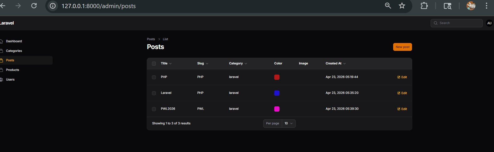
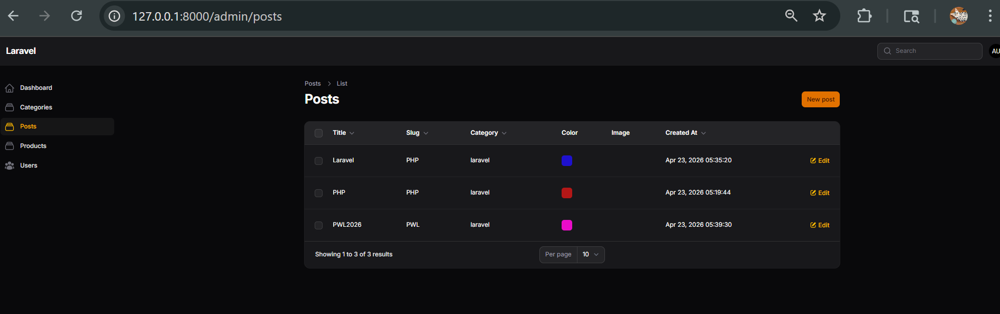
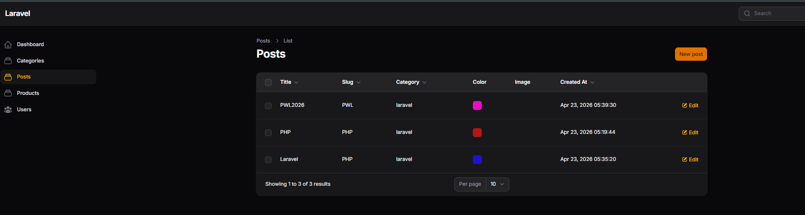
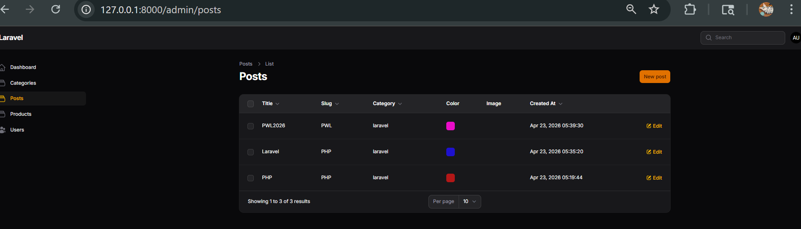

## NAMA: RENY AMBARWATI
## NIM: 244107020066
## KELAS:TI-2F
## ABSEN: 25

## Laporan Praktikum: Pertemuan 10 – Implementasi Sorting pada Table Filament

# A. Pendahuluan
Praktikum ini membahas implementasi fitur sorting (Ascending & Descending) pada framework Filament untuk mempermudah manajemen data berskala besar, seperti mengurutkan data berdasarkan judul, kategori, maupun tanggal pembuatan.
# B. Implementasi Kode & Penyelesaian Latihan
Sesuai dengan instruksi modul, berikut adalah langkah penyelesaian latihannya:
1. Mengaktifkan sorting pada semua kolom teks: Menambahkan method ->sortable() pada kolom title, slug, category.name, dan created_at.
2. Membuat default sorting berdasarkan Created At descending: Menambahkan method ->defaultSort('created_at', 'desc') pada akhir array komponen konfigurasi tabel.
public static function configure(Table $table): Table
{
    return $table
        ->columns([
            TextColumn::make('title')
                ->sortable(),
            TextColumn::make('slug')
                ->sortable(),
            TextColumn::make('category.name')
                ->sortable(),
            ColorColumn::make('color'),
            ImageColumn::make('image')
                ->disk('public'),
            TextColumn::make('created_at')
                ->label('Created At')
                ->dateTime()
                ->sortable(),
        ])
        ->defaultSort('created_at', 'desc')
        // ... konfigurasi filters dan actions
}

# Sorting Title Asc

# Sorting Title Desc

# Sorting Date Desc

# C. Jawaban Analisis & Diskusi
1. Mengapa sorting penting pada admin panel?
Sorting sangat penting untuk memudahkan administrator atau pengguna dalam mencari, memantau, dan mengorganisir data secara cepat. Ketika jumlah rekaman sudah ribuan, kemampuan menyusun data (A-Z, terbaru ke terlama) menghemat waktu pencarian secara signifikan.
2. Apa perbedaan sortable biasa dengan defaultSort()?
Method sortable() merupakan *modifier* per kolom yang memunculkan icon sort di header tabel agar kolom tersebut *bisa* diurutkan saat diklik oleh user. Sedangkan defaultSort() adalah pengaturan level tabel (global) yang menentukan urutan awal data saat halaman *pertama kali dimuat*, tanpa perlu user mengklik apapun.
3. Mengapa relasi tetap bisa di-sort?
Filament di belakang layar menggunakan query builder milik Eloquent Laravel. Saat kita mendefinisikan relasi category.name lalu memberinya modifier sortable, Filament secara otomatis merakit query JOIN ke tabel relasi tersebut dan menyisipkan sintaks ORDER BY, sehingga tidak diperlukan query manual.
4. Kapan kita menggunakan desc sebagai default?
Pengurutan DESC (Descending) sebagai default paling sering dan paling tepat digunakan pada kolom berbasis waktu seperti created_at atau updated_at. Tujuannya adalah agar user (misalnya admin panel) selalu disajikan *data terbaru*, transaksi terkini, atau entri terakhir di posisi teratas tanpa harus men-scroll.
# D. Kesimpulan
Melalui praktikum pertemuan 10 ini, fitur pengurutan (sorting) data pada tabel Filament telah berhasil diimplementasikan dengan mudah. Kelebihan Filament sangat terasa karena developer cukup memanggil satu method berantai untuk menangani sorting kolom string biasa, data relasional, hingga tipe data waktu, sekaligus mengatur prioritas urutan tampilannya saat aplikasi diakses.
