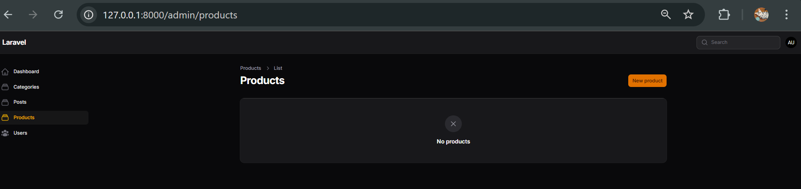
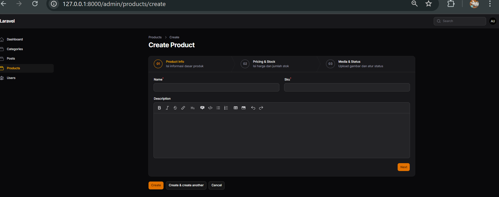
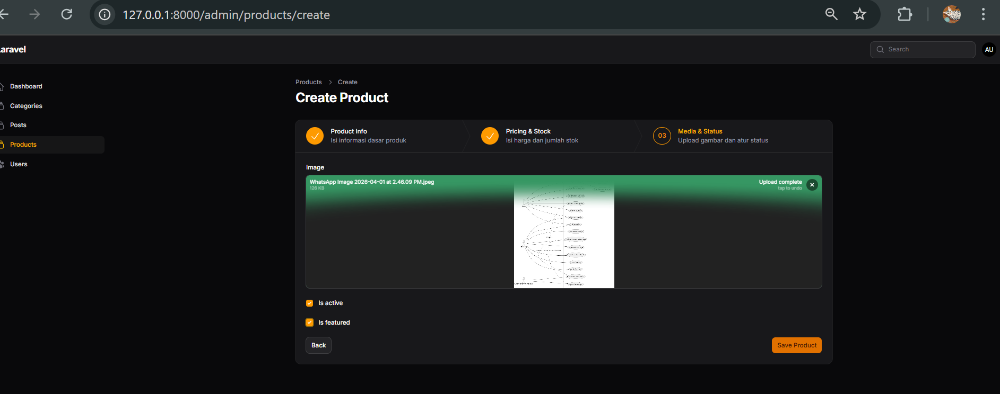
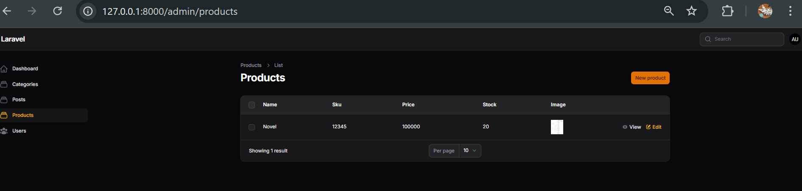

## NAMA: RENY AMBARWATI
## NIM: 244107020066
## KELAS:TI-2F
## ABSEN: 25

## Laporan Jobsheet 1 – Implementasi Wizard Form (Multi Step Form) di Filament

# A. Pendahuluan
Praktikum ini bertujuan untuk mengimplementasikan Wizard Form (Multi Step Form) pada Framework Filament untuk mempermudah pengisian data form yang panjang dan kompleks, seperti form produk pada e-commerce.
# B. Langkah-langkah Praktikum
1. Pembuatan Struktur Database dan Model
Langkah pertama adalah membuat file migration untuk tabel produk, mendefinisikan kolom sesuai kebutuhan (name, sku, description, price, stock, image, is_active, is_featured), menjalankan migrasi database, dan membuat Model Product.
php artisan make:migration create_products_table
php artisan migrate
php artisan make:model Product

2. Membuat Resource Product
Resource product dibuat menggunakan perintah Filament dengan menentukan attribute utama (name) dan tidak meng-generate langsung dari database agar bisa dikustomisasi secara manual.
php artisan make:filament-resource Product

3. Implementasi Wizard Form
Modifikasi pada file ProductForm.php dilakukan dengan menggunakan komponen Wizard::make() yang membagi form menjadi 3 tahap:
Product Info: Berisi field Name dan SKU dalam 2 kolom, serta Description (MarkdownEditor) dengan ukuran penuh.
Pricing & Stock: Berisi field Price dan Stock dengan validasi tipe data numerik (numeric) dan wajib diisi (required).
Media & Status: Berisi field Image menggunakan FileUpload (menyimpan di public disk), is_active, dan is_featured (Checkbox).

4. Kustomisasi Tombol Submit
Menambahkan action custom untuk submit (Save Product) pada bagian akhir Wizard dan menghilangkan default button pada method getFormActions() di file CreateProduct.php.

5. Menampilkan Data di Tabel
Memodifikasi ProductsTable.php untuk menampilkan kolom data produk seperti nama, sku, harga, stok, dan gambar (menggunakan ImageColumn dengan disk public).

# C. Jawaban Analisis & Diskusi
1. Mengapa Wizard Form lebih baik untuk form panjang?
Wizard form membagi form panjang menjadi beberapa langkah (chunk) kecil yang logis. Hal ini mengurangi beban kognitif pengguna, membuat form tidak terlihat mengintimidasi, dan membantu memandu user menyelesaikan isian secara berurutan.

2. Kapan kita menggunakan skippable()?
Method skippable() digunakan ketika sebuah step bersifat opsional atau informasinya bisa ditunda pengisiannya. Pengguna diizinkan melewati langkah tersebut dan langsung menuju langkah berikutnya tanpa memicu validasi error.

3. Apa kelebihan multi step dibanding single form panjang?
Multi step form meningkatkan tingkat penyelesaian (conversion rate) karena progresnya terukur (menggunakan progress bar/step indikator), validasi error ditangani secara parsial per langkah (mencegah error menumpuk di akhir submit), serta pengelompokan datanya lebih terstruktur.

4. Apakah wizard cocok untuk semua jenis form?
Tidak. Wizard form kurang cocok untuk form yang singkat (misalnya form login, registrasi dasar, atau pencarian) karena justru akan menambah durasi klik dan menurunkan efisiensi antarmuka.

# D. Kesimpulan
Melalui praktikum ini, telah berhasil diimplementasikan Wizard Form pada Filament. Pendekatan ini terbukti sangat efektif untuk mengelola alur input data produk e-commerce yang kompleks. Proses validasi per step dan kustomisasi aksi berjalan dengan lancar, memberikan pemahaman mengenai pembuatan antarmuka aplikasi panel admin yang profesional dan user-friendly.
